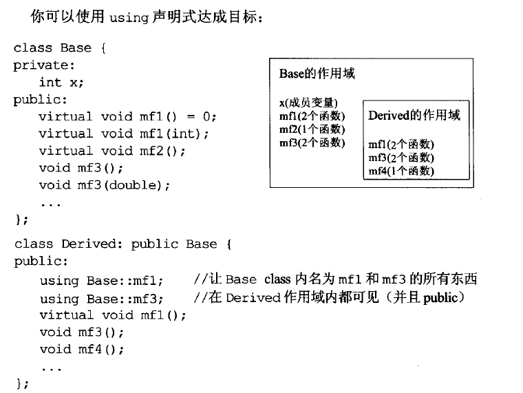
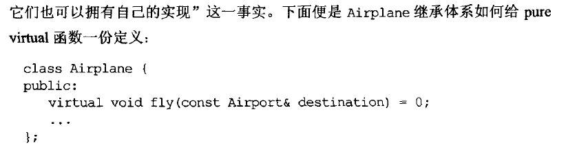

# Effective C++

## 条款3：尽可能使用const

### const 避免匿名变量被修改

```c++
class Rational {...};
const Rational operator* (const Rational& left, const Rational& right);
```

类似于`a*b`的操作返回的是一个匿名变量，它不应该可做左值，所以我们用`const`限定`operator*`的返回值以避免类似`(a*b) = c`的错误

### 与const有关的摆动变量声明：mutable

```c++
class CTextBlock{
  mutable int a;
  mutable std::string str;
};
```

这些成员函数总是能够被修改，即使是在`const`函数内

### 使用常量性转除避免const和非const函数的代码重复

```c++
class TextBlock{
public:
	const char& operator[](size_t position) const{
        ...
    }
    char& operator[](size_t position){
        return const_cast<char&>(static_cast<const TextBlock&>(*this)[position])
    }
};
```

**warning:**

可以用非const函数调用const函数来避免代码重复，而不应该反过来。

## 条款6：取消编译器自动提供的机能

为驳回编译器自动（暗自）提供的机能，可将相应的成员函数声明为private并不予实现。使用像Uncopyable这样的`base class`也是一种做法。


## 条款9：绝不在构造和析构函数中调用virtual函数

保证构造函数和析构函数所调用的所有函数也符合这一要求。

## 条款10：另operator= 返回一个 reference to *this

为处理`x=y=z=15`的形式

## 条款11：在operator= 中处理"自我赋值"

```c++
Widget& Widget::operator=(const Widget& rhs){
    delete pb;
    pb = new Bitmap(*rhs.pb);
    return *this;
}
```


### 解决1：

使用`if (this == & rhs) `来进行正同测试。

但此项操作会带来一定开销，使得每一次调用`operator=`时都带来额外开销

### 解决2：


### 解决3：使用copy and swap 技术


更多详情可见条款29

## 条款13：以对象管理资源

对于动态申请的内存，最好放在`auto_ptr`或`trl::shared_ptr`中，使得其在离开作用域时被释放（有时候会忘了或因为异常处理等而没有被释放）


## 条款17：以独立语句将newed对象置入智能指针


## 条款18：让接口容易被正确使用，不易被误用


不要直接返回指针，这样会带来忘记删除的潜在风险，而返回智能指针可以消除这样的风险。

## 条款20：宁以pass-by-reference-to-const替换pass-by-value


## 条款23：宁以non-member、non-friend替换member函数


## 条款24：若所有参数皆需类型转换，请为此采用non-member函数


## 条款25：考虑写出一个不抛异常的swap函数

较为难以理解

## 条款26：尽可能延后变量定义出现时间


## 条款27：尽量少做转型动作


## 条款31：将文件间的编译依存性降到最低


## 条款32：确定你的public继承塑模出'is-a'关系


正方形继承自矩形不一定正确（矩形能够拥有单独改变长宽的操作）

## 条款33：避免遮掩继承而来的名称

保证条款32提到的'is-a'关系一定成立



## 条款34：区分接口继承和实现继承




## 条款37：不重新定义继承而来的缺省参数值


## 条款42：了解typename的双重意义


### 知识点：模板全特化


## 知识点43：学习处理模板化基类内的名称


## 条款45：运用成员函数模板接受所有兼容类型

### *使用模板泛化构造函数*

详细可见原文